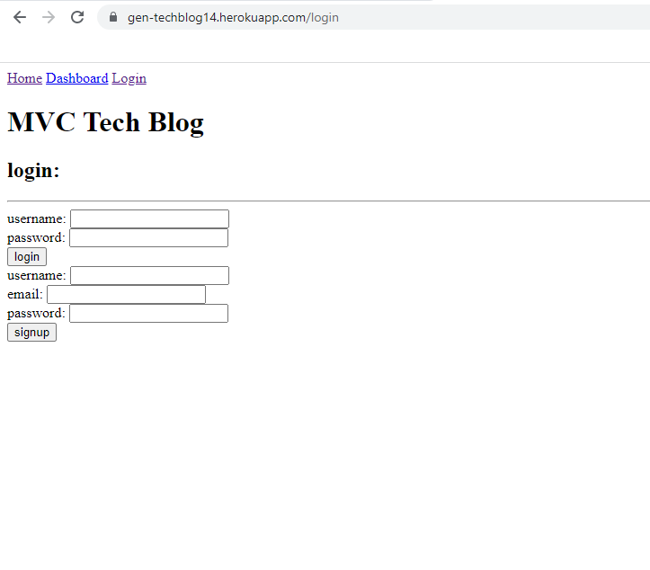

# gen-MVC-TECHBLOG14

## User Story

AS A developer who writes about tech
I WANT a CMS-style blog site
SO THAT I can publish articles, blog posts, and my thoughts and opinions

## Description

In this project, I attempted to create a teck blog where I use skills I have learnt from both front & back end in order to create a fully functioning application. However due to time constraints, having to complete the second project, and the enormity of this assignment, I was unable to complete this challenge to a suffecient level.

## Heroku url

https://gen-techblog14.herokuapp.com/

## Github URL

https://github.com/haiderali1998/gen-MVC-TECHBLOG14

## Screenshot

<section>
    
</section>